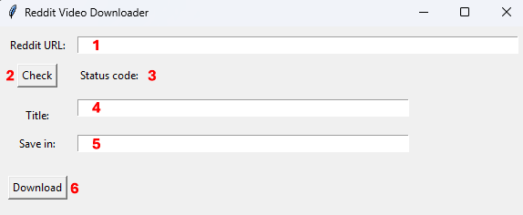

# Reddit video Downloader 

This is a simple Python script with a gui and a CLI to download videos and gifs that are hosted on Reddit. This does not work for videos/gifs hosted on third party services like imgur.com.
***
Most videos are hosted on and downloaded from packaged-media.redd.it. If not they will be downloaded from v.redd.it. 

Videos on v.redd.it are not contained in a mp4 container file and need to be merged into one to have audio and video. To do this the [FFmpeg](https://www.ffmpeg.org/) command line tool is used (see: [src/ffmpeg_cmd.py](https://github.com/JustAName3/Reddit-Video-Downloader/blob/master/src/ffmpeg_cmd.py)). [FFmpeg](https://www.ffmpeg.org/) must be installed on your system in order for this to work. 

## Setup
1. Download or `git clone` the repository 

2. Install the requirements listed in requirements.txt

    `pip install -r requirements.txt`

3. Install FFmpeg on your system. If you don't know how, google "FFmpeg install guide".

If you install the requirements in a venv you need to add a shebang pointing to the python interpreter of your venv in the main.py file.

## GUI

1. Enter URL to Reddit post here.
2. If you press the "check" button the information will be preloaded. This is optional. 
3. Status code of the https response will be displayed here.
4. Name of the .mp4/.gif file that will be saved. If you press "check" the title of the Reddit post will be inserted.
5. Enter path to where the video should be saved in. When no path is given the default path will be inserted (C:\Users\user\Videos, works only on windows).
6. Press to download. Be sure to put in a title for the file or press "check" before.  

## CLI

The code for the cli is in the cli.py file. You can execute it directly or use the reddit.bat file.
I recommend to add the project folder (where the reddit.bat file is) to your PATH so you can run the command by just calling "reddit".
The .bat file looks for a venv, if found it uses the Python interpreter in it. If not it uses the global interpreter. The venv folder needs to be named either "venv" or ".venv".

Command structure: reddit {URL} -{flag1} -{flag2}

The URL to the video has to be the first argument. After that you can pass optional arguments.

As of now there are two optionals:

-t: Change title of file. By default the title of the reddit post will be used as the file name.

-p: Change path in which the video will be saved. By default it gets stored in the videos directory of the user.

Example: `reddit www.reddit.com/SomeVideo -tTestVideo -pC:\Users\user\Desktop`

***  

Please use responsible. Feel free to open [issues](https://github.com/JustAName3/Reddit-Video-Downloader/issues) on GitHub if you encounter errors.